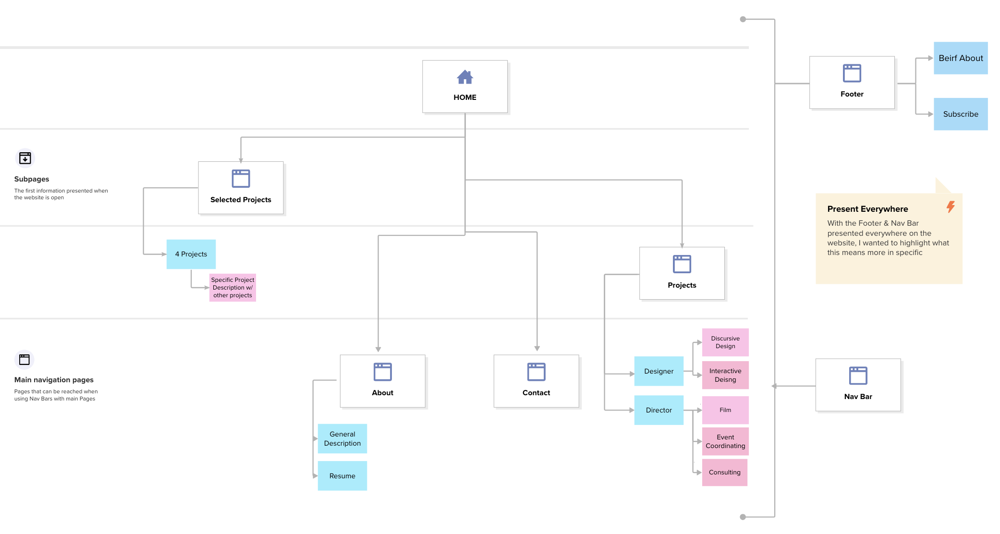

# yuripark518.github.io
This is a portfolio website of Yuri Park

# Project Overview

## Purpose
This portfolio website aims to showcase diverse abilities through original assets like illustrations and 
customized images, alongside unconventional interaction methods. It's tailored for potential collaborators or 
recruiters, offering comprehensive insights into creativity and capabilities before reaching out.

## Sitemap

## How to Set Up
1. By clicking on this [link](https://we.tl/t-nm1hfZTgvs) you will be able to download the whole zip file called websiteCode.zip containing a file called "new" with all the necessary assests to run the website
2. Do not move or change any names in the file as it is intentionally done so to make the code read the assets.
3. If you are using Visual Studio Code and want to edit and see the changes immediately, download Live Server on Visual Studio Code. Here's a [guide](https://www.geeksforgeeks.org/how-to-enable-live-server-on-visual-studio-code/) on how to enable Live Server.
